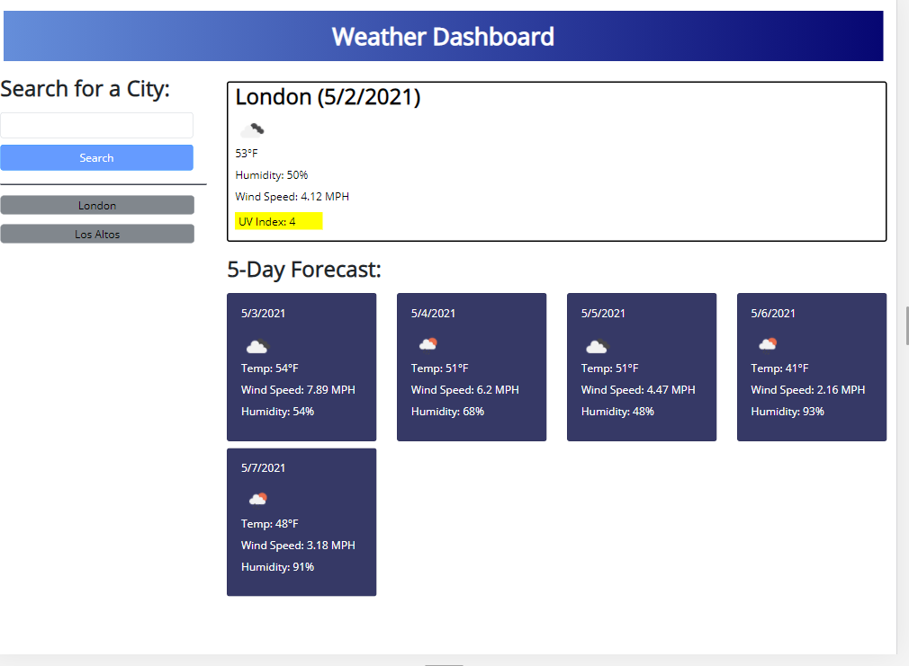

# Weather Dashboard

Live URL: https://augustinandrea.github.io/weather_dashboard/

Github Repo: https://github.com/augustinandrea/weather_dashboard

Summary:
This is a website where you can look up different cities and see the weather for those cities. It will show the city name, date, icon for the weather, temp, humidity, wind speed, and UV index. There is today's weather and a 5-day forecast. The website will keep the cities you have looked up, even if it is reloaded. 

